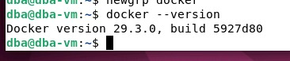
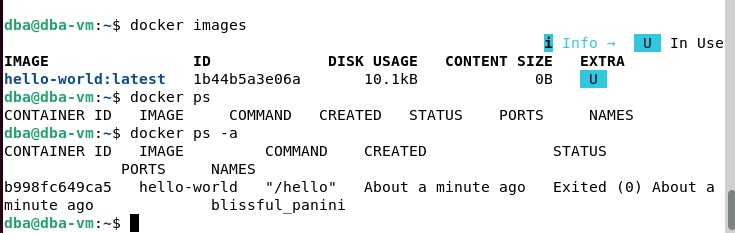
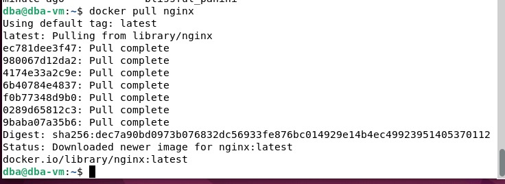
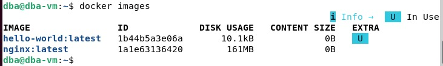
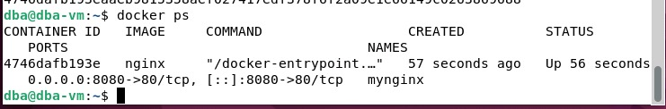
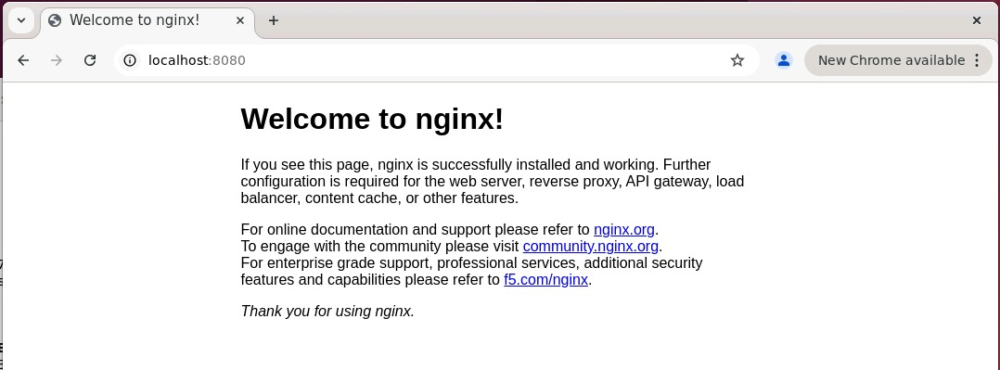

# Лабораторная работа №1  
## Установка и настройка Docker. Работа с контейнерами

## Ход работы

### Подготовка среды

- Скачан образ виртуальной машины `dev_kub_student.ova`
- Импортирован в VirtualBox
- Выполнен запуск виртуальной машины
- Все дальнейшие действия выполнялись в терминале ВМ

---

### Установка Docker
Проверка установки

**Команды Docker CLI**

 

### Шаг 1. Скачивание образа nginx

### Шаг 2. Проверка, что образ скачался

### Шаг 3. Запуск контейнера с пробросом портов

### Шаг 4. Проверить, что контейнер запущен

### Шаг 5.  Проверить работу веб-сервера через браузер

**Вывод**

В ходе лабораторной работы были изучены основы работы с Docker, включая установку, управление образами и контейнерами. На практике был запущен веб-сервер Nginx в контейнере с настроенным пробросом портов, что позволило обеспечить доступ к сервису через браузер. Полученные навыки являются базовыми для дальнейшего изучения контейнеризации и разработки микросервисных приложений.
