# Лабораторная работа №2
## Создание Dockerfile и сборка образа

### Вариант 1
Тема данных:
- Предметная область: E-commerce Sales
- Примерные поля данных: 	ID заказа, дата, сумма, категория товара, статус возврата.

Техническое задание:
- Стек технологий: Python + Pandas (CLI)
- Задание (Аналитика + Docker): Скрипт генерирует DataFrame, рассчитывает основные статистики (describe()), сохраняет результат в .txt файл и выводит содержимое файла в консоль (cat).

## Ход работы

### Этап 1. Подготовка окружения
- создать папку проекта;
- сделать правильную структуру файлов;
- проверить, что в системе есть нужные инструменты;
- подготовить всё так, чтобы дальше писать код и Dockerfile.

### Создание папки проекта
- `mkdir lab_02.1` — создаёт корневую папку лабораторной;
- `cd lab_02.1` — переходит в неё;
- `mkdir app` — создаёт папку для исходного кода.

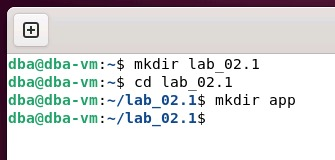

Проверка

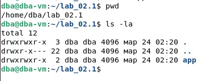

### Этап 2. Написание аналитического скрипта
В файле app/main.py будет Python-скрипт, который:
- создаёт синтетические данные по продажам в e-commerce;
- оформляет их в таблицу Pandas;
- считает основные статистики;
- записывает их в текстовый файл;
- показывает результат в терминале.

Код скрипта

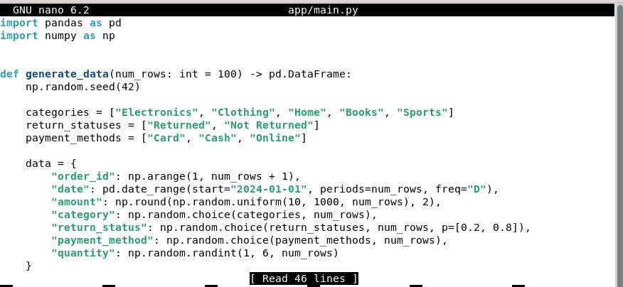

Проверка скрипта локально

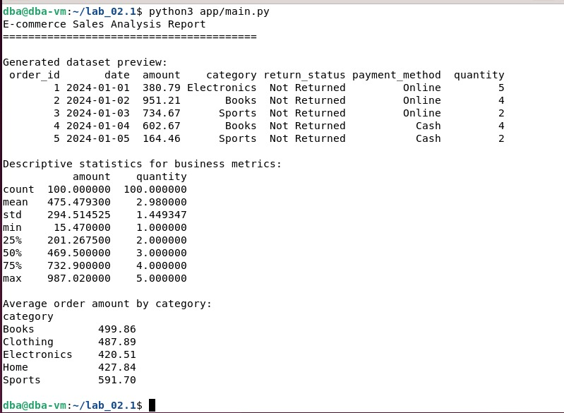

Итого:
- Данные генерируются синтетически, чтобы приложение было автономным и воспроизводимым.
- Pandas используется для формирования и анализа DataFrame.
- Метод describe() применён как требуется в техническом задании.
- Результат сохраняется в result.txt, после чего его содержимое выводится в консоль.
- Скрипт работает как CLI-приложение, без веб-сервера, что соответствует варианту.

### Этап 3. Подготовка зависимостей (requirements.txt)
Этот файл нужен, чтобы:
- Docker понимал, что именно устанавливать в контейнер;
- проект можно было легко воспроизвести на другой машине;
- сборка была понятной и стандартной.

Файл requirements.txt

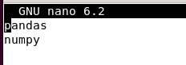

### Этап 4. Создание Dockerfile
Что должен делать Dockerfile:

- есть Python-скрипт `app/main.py`;
- есть зависимости в `requirements.txt`;

при запуске контейнер должен выполнить:
- python app/main.py

скрипт создаст `result.txt` и выведет содержимое в консоль.

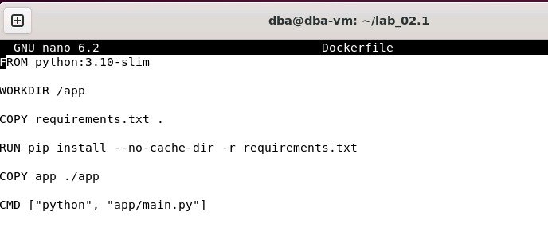

### Этап 5. Создание .dockerignore

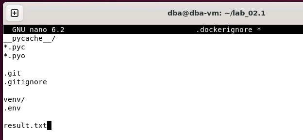

### Этап 6. Сборка образа и запуск контейнера

Сборка Docker-образа:

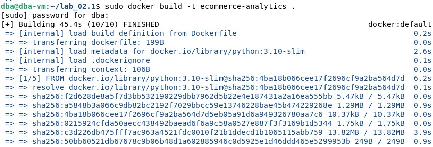

Запуск контейнера:

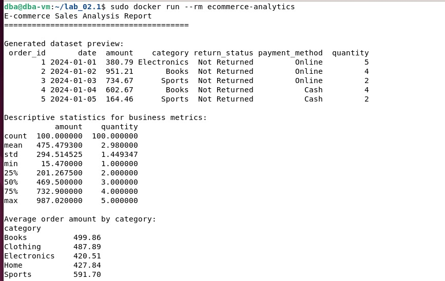

- На этапе сборки был создан Docker-образ командой `docker build -t ecommerce-analytics ..`
- В процессе сборки Docker выполнил инструкции из `Dockerfile`: установил зависимости, скопировал исходный код и подготовил контейнер к запуску.
- Затем контейнер был запущен командой `docker run --rm ecommerce-analytics`, после чего внутри контейнера выполнился аналитический Python-скрипт.
- Скрипт сгенерировал данные, рассчитал описательные статистики, сохранил их в `result.txt` и вывел содержимое файла в консоль.

### Этап 7. Docker Compose

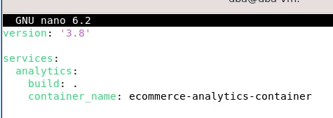

### Этап 8. Запуск через Docker Compose

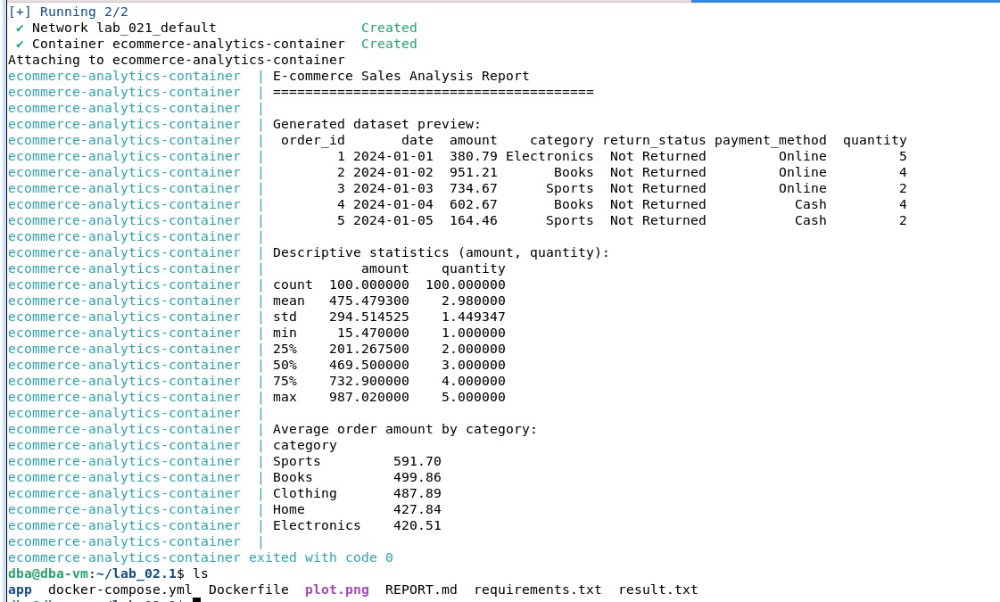

### Визуализация

Реализована визуализация результатов анализа с использованием библиотеки matplotlib. Построен столбчатый график среднего значения суммы заказа (amount) по категориям товаров (category). Перед построением данные были сгруппированы и отсортированы по убыванию среднего значения. График сохраняется в файл plot.png в процессе выполнения скрипта и может быть открыт локально.

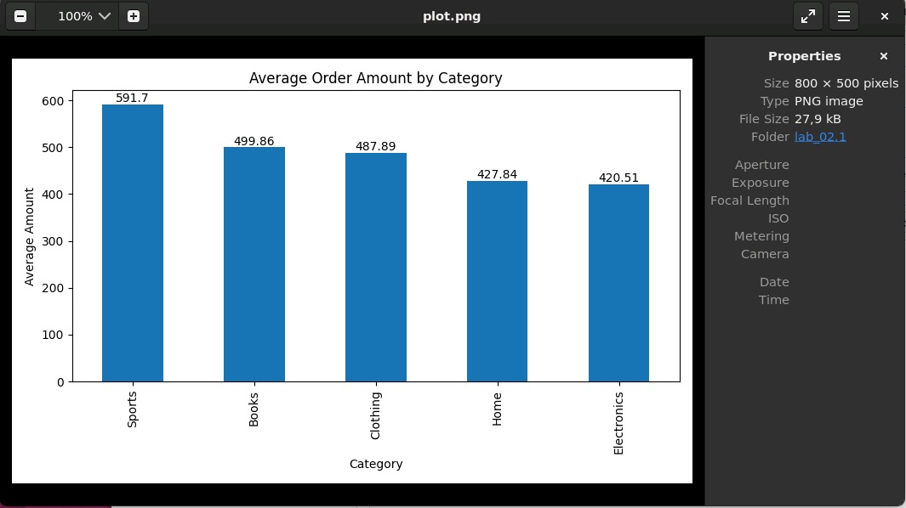

### Файлы

- [main](main.py) - код аналитического приложения 
- [dockerfile](Dockerfile) - Файл инструкций сборки
- [requirements](requirements.txt) - Файл зависимостей
- [result](result.txt) - результат 

