# Лабораторная работа 3.1

## Развертывание приложения в Kubernetes

---

## 1. Титульный лист

**ФИО:** Вознесенская Вероника Евгеньевна
**Группа:** АДЭУ-221
**Вариант:** 1

**Задание:**
Развернуть аналитическое приложение (Jupyter Notebook) в Kubernetes и обеспечить сохранение данных с использованием постоянного хранилища (PVC).

---

## 2. Цель работы

Освоить процесс оркестрации контейнеров в Kubernetes.
Научиться разворачивать приложение и подключать к нему постоянное хранилище, а также обеспечивать доступ к приложению через Service.

---

## 3. Ход выполнения

### 3.1 Проверка состояния кластера

Перед началом работы был проверен статус Kubernetes-кластера

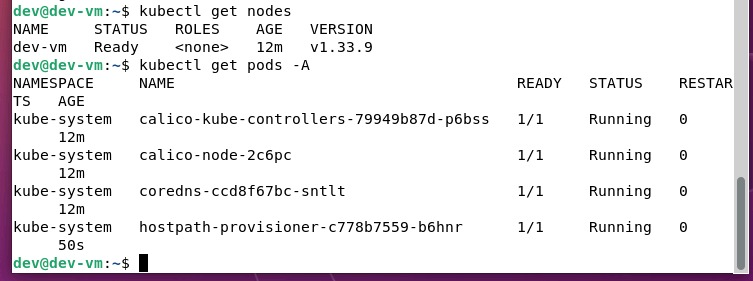


### 3.2 Создание структуры папок, постоянного хранилища (PVC)

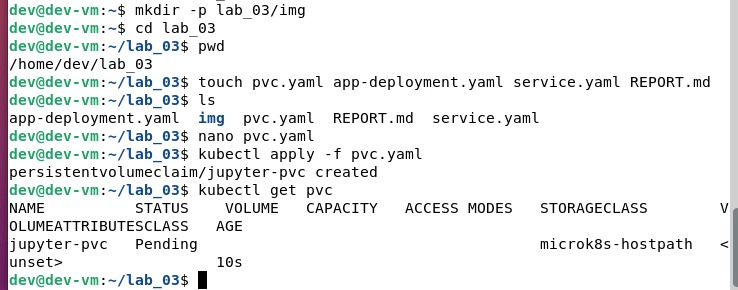

Файл: `pvc.yaml`

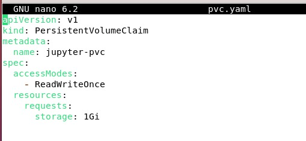


**Пояснение:**

* `PersistentVolumeClaim` — запрос на выделение хранилища
* `storage: 1Gi` — объём хранилища
* `ReadWriteOnce` — доступ на запись с одного узла


### 3.3 Создание Deployment (Jupyter Notebook)

Файл: `app-deployment.yaml`

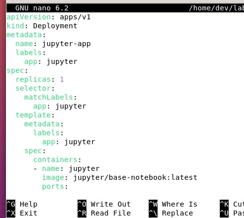


### 3.4 Создание Service

Файл: `service.yaml`

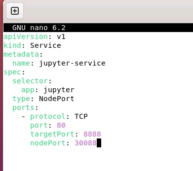

**Пояснение:**

* `NodePort` — открывает доступ к приложению извне
* `selector` — связывает Service с Pod
* `targetPort: 8888` — порт контейнера
* `nodePort: 30088` — внешний порт


### 3.5 Проверка работоспособности

Были выполнены команды:

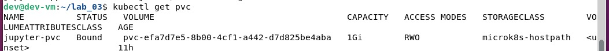

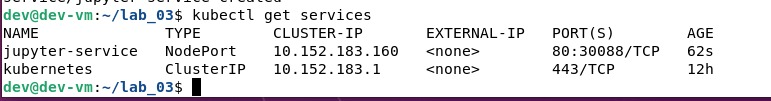

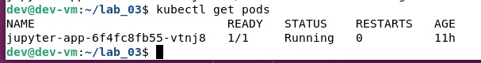

Результат:

* Pod находится в статусе `Running`
* Service доступен по NodePort

Приложение доступно по адресу:

```text
http://192.168.14.48:30088
```


### 3.6 Проверка постоянного хранения данных

В Jupyter Notebook был создан файл `test_lab3.ipynb`.

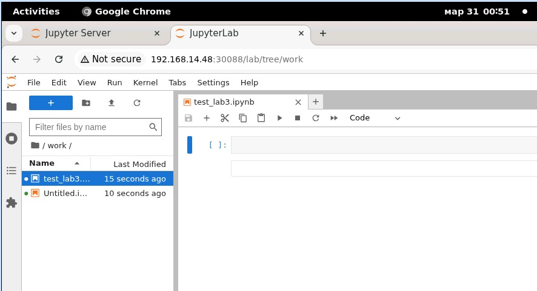

После удаления Pod:


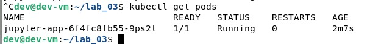

Kubernetes автоматически создал новый Pod.
После повторного входа в Jupyter файл остался на месте.

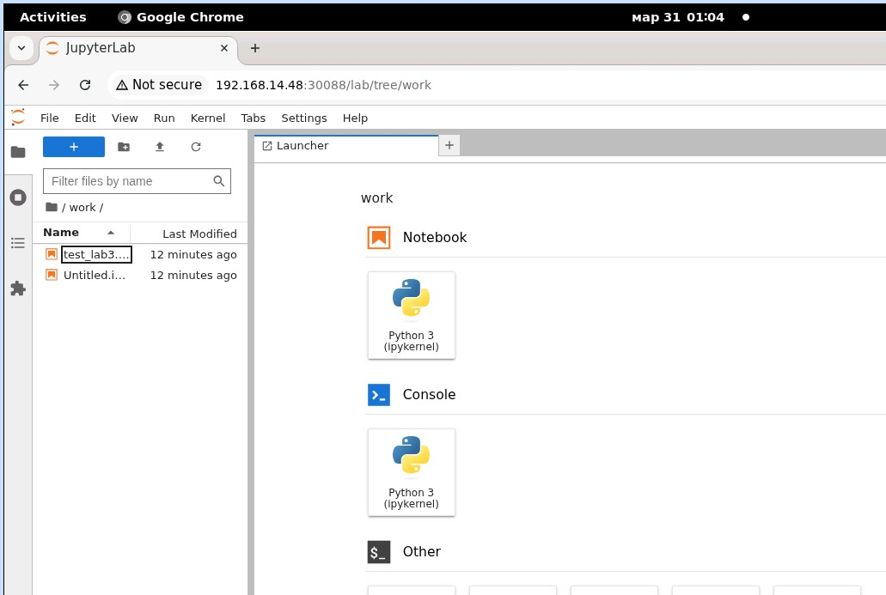

Это подтверждает корректную работу PVC и постоянного хранилища.

# В рамках расширения лабораторной работы была реализована связка сервисов
Аналитическое приложение (Jupyter Notebook) и база данных PostgreSQL.

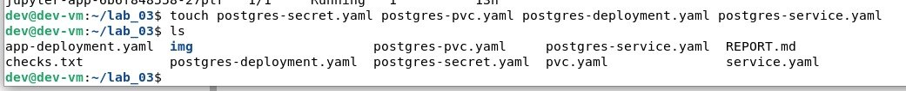

Для хранения учетных данных базы был создан объект Kubernetes Secret.

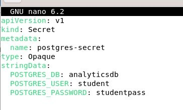

Создание постоянного хранилища для PostgreSQL

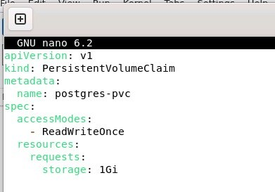

Создание Deployment PostgreSQL

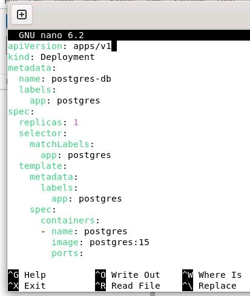

Создание Service для PostgreSQL

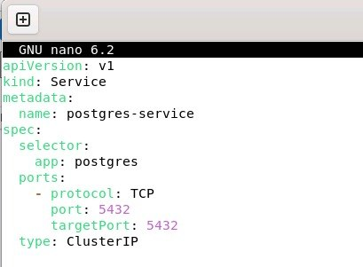

# Заполнение базы данных тестовыми данными

В PostgreSQL была создана таблица sales и сгенерировано 1000 строк данных с использованием функции generate_series.

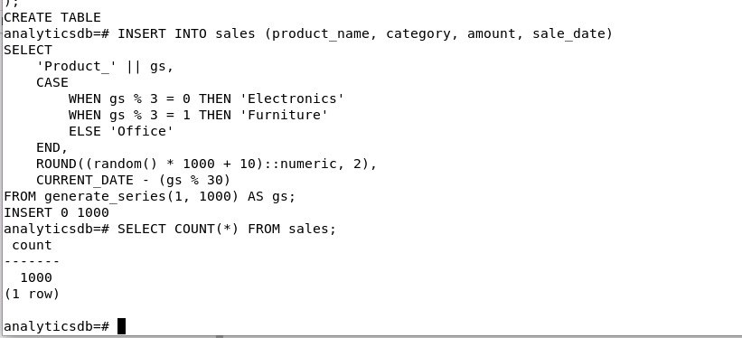

Проверка

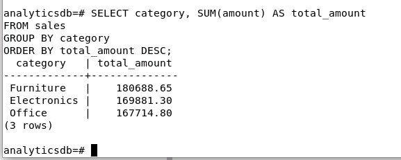

# Подключение Jupyter к PostgreSQL

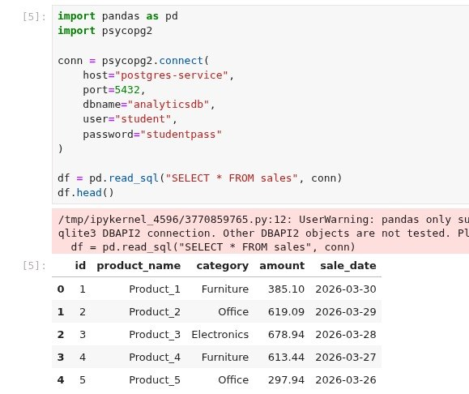

# Анализ данных и визуализация

Был выполнен базовый анализ:

- группировка по категориям
- расчёт суммарных продаж
- анализ динамики по датам

Построены графики:

- сумма продаж по категориям
- динамика продаж по времени

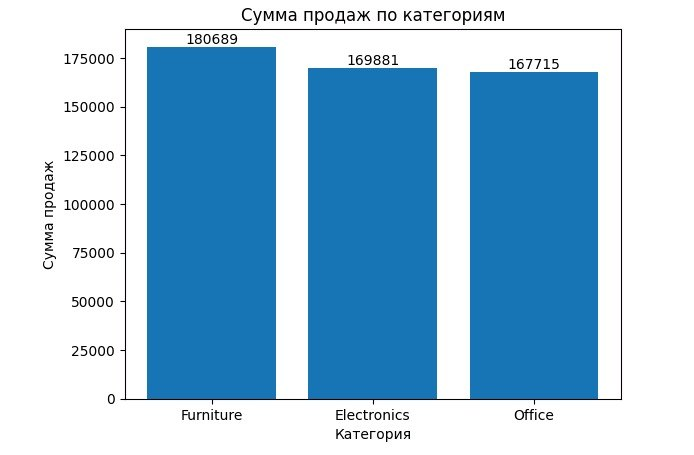

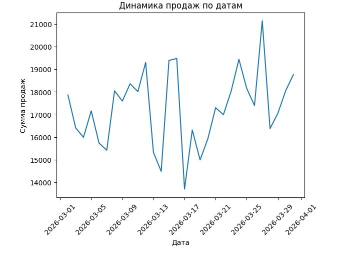

# Удаление pod

Создался новый благодаря Deployment, ноутбук остался

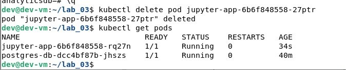

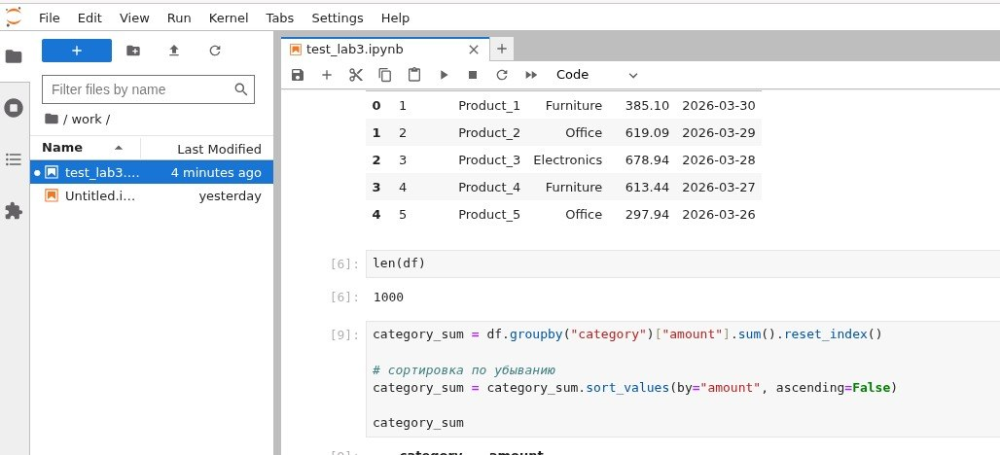

## 5. Выводы

В ходе лабораторной работы был освоен процесс развертывания приложения в Kubernetes.

Были получены навыки:

* создания Deployment и Service
* работы с PersistentVolumeClaim
* настройки сетевого доступа к приложению
* обеспечения сохранения данных

Kubernetes позволяет удобно управлять приложениями, автоматически перезапускать контейнеры и сохранять данные независимо от жизненного цикла Pod.

Основные трудности возникли при настройке доступа к Jupyter (token/пароль) и понимании работы PVC, однако после настройки система работает стабильно.


