# Лабораторная работа 4.1

## Создание и развертывание полнофункционального приложения

---

## Титульная информация

**ФИО:** Вознесенская Вероника Евгеньевна
**Группа:** АДЭУ-221
**Вариант:** 1 — Task Tracker

**Тема:** Разработка и развертывание трехзвенного приложения (Frontend + Backend + Database) в Kubernetes.

---

## Цель работы

Освоить создание и развертывание трехзвенного приложения в Kubernetes, организовать взаимодействие между микросервисами и обеспечить их совместную работу.

## Архитектура приложения

Приложение состоит из трех компонентов:

* **Frontend (Streamlit)** — пользовательский интерфейс
* **Backend (FastAPI)** — API для работы с задачами
* **Database (PostgreSQL)** — хранение данных

### Взаимодействие сервисов:

* Frontend → Backend: `lab41-backend-service:8000`
* Backend → Database: `lab41-postgres-service:5432`

## Используемые технологии

* Python
* FastAPI
* Streamlit
* PostgreSQL
* Docker
* Kubernetes (MicroK8s)

## Ход выполнения

### 1. Создание backend (FastAPI)

Реализовано API для работы с задачами:

* `GET /tasks` — получение списка задач
* `POST /tasks` — добавление задачи

Модель данных:

* title
* description
* status
* priority

Backend подключается к PostgreSQL через переменные окружения.

### 2. Создание frontend (Streamlit)

Реализован интерфейс:

* форма добавления задачи
* отображение списка задач
* обновление данных

Frontend взаимодействует с backend через HTTP-запросы.

### 3. Контейнеризация (Docker)

Созданы Dockerfile для:

* backend
* frontend

Собраны Docker-образы:

* `task-backend:v1`
* `task-frontend:v1`

### 4. Kubernetes-манифесты

Созданы ресурсы:

* Secret (для БД)
* PersistentVolumeClaim (для PostgreSQL)
* Deployment и Service для:

  * PostgreSQL
  * Backend
  * Frontend

Для изоляции использован namespace `lab41`.

## 5. Развертывание приложения

### Дерерво проекта:

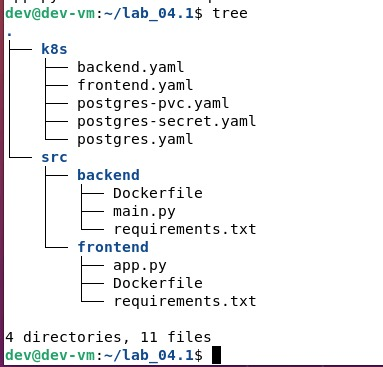

### backend/main.py

[file_backend_main.py](backend/main.py) - файл

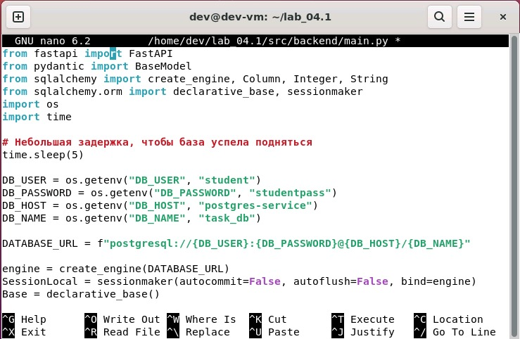

### frontend/app.py

[file_frontend_app.py](frontend/app.py) - файл
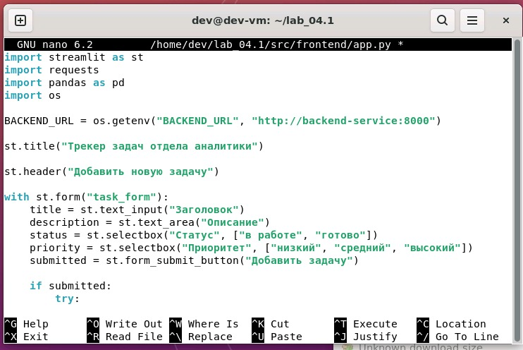

### Сборки

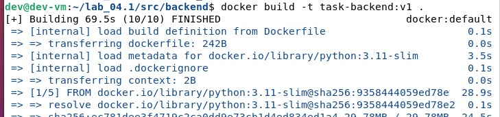

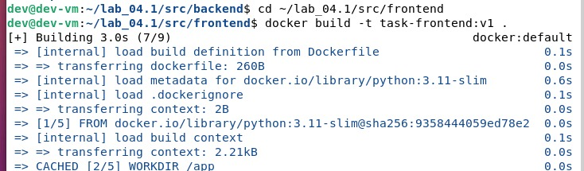

Осуществлен импорт backend-образа, frontend-образа, проверка:

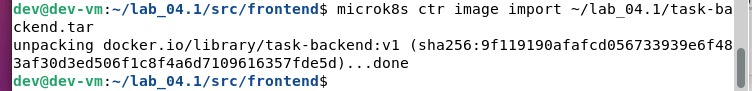

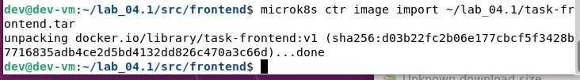

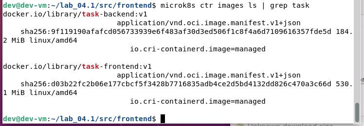

### postgres-secret.yaml

[postgres-secret.yaml](postgres-secret.yaml) - файл

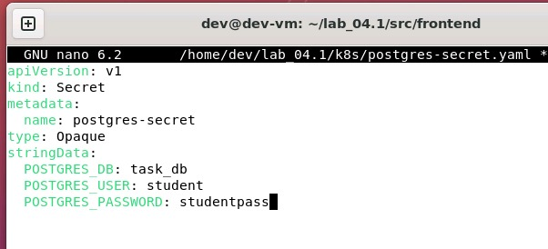

### postgres-pvc.yaml

[postgres-pvc.yaml](postgres-pvc.yaml) - файл

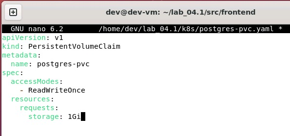

### postgres.yaml

[postgres.yaml](postgres.yaml) - файл

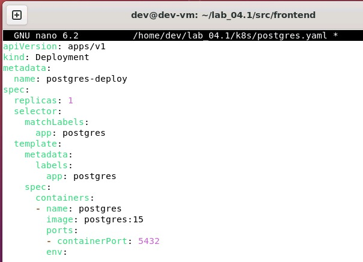

### k8s/backend.yaml

[k8s/backend.yaml](backend.yaml) - файл

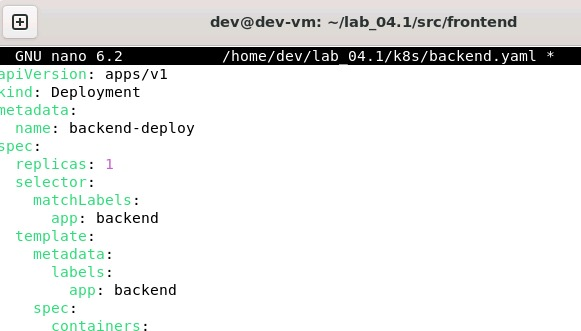

### k8s/frontend.yaml

[k8s/frontend.yaml](frontend.yaml) - файл

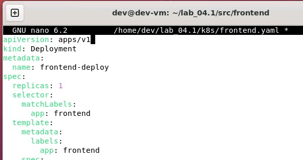

### Применить Secret для PostgreSQL

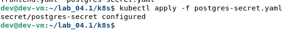

### Развернуть PostgreSQL

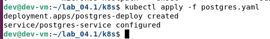

## Интерфейс

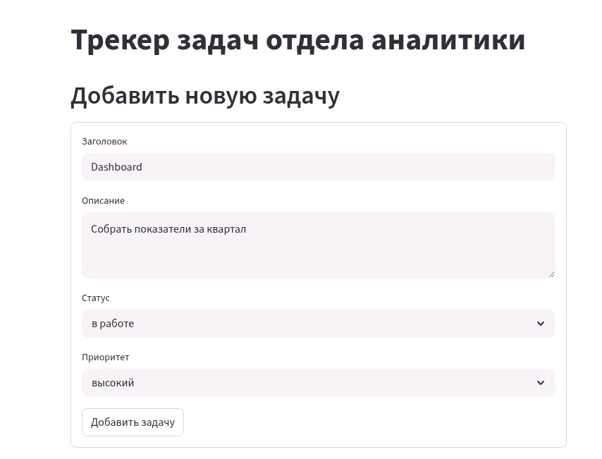

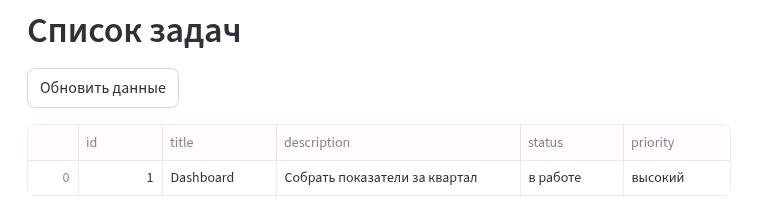

Посмотреть логи backend:

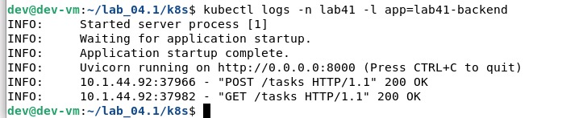

FastAPI через port-forward:

![s19](img/s19.jpg

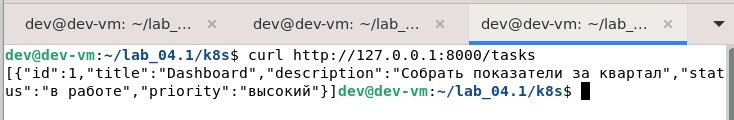

## Выводы

В ходе работы:

* освоена архитектура микросервисного приложения
* реализовано взаимодействие сервисов через Kubernetes Service
* изучена контейнеризация приложений
* получен опыт развертывания и тестирования системы

Kubernetes значительно упрощает управление сервисами, их масштабирование и взаимодействие.

